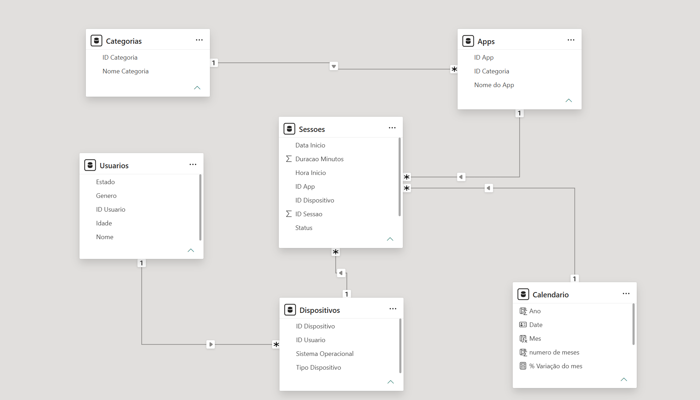

# Analise-Tempo-Tela-Redes-Sociais
Análise de Tempo de Tela em Redes Sociais — Power BI

Projeto de estudo com dados fictícios, desenvolvido para praticar limpeza de dados, modelagem relacional em esquema snowflake, Time Intelligence e construção de dashboard no Power BI.

[Dashboard final](imagens/dashboard-geral.png)

  
Sobre o projeto

A base simula sessões de uso de aplicativos de redes sociais, streaming e jogos, com 5 tabelas relacionadas em esquema snowflake: Usuários → Dispositivos → Sessões ← Apps ← Categorias.

Os dados brutos (pasta /dados) foram gerados com problemas reais de qualidade, de propósito, para simular uma base de produção:

Datas em 3 formatos diferentes na mesma coluna
Valores nulos em Idade, Categoria e Duração
Duração negativa (erro de medição) e um outlier de 850 minutos numa única sessão
Colisão de ID: duas sessões diferentes compartilhando o mesmo identificador
App duplicado (Instagram cadastrado duas vezes com nomes quase idênticos)
Tipo de Dispositivo com 5 variações de escrita para as mesmas 3 categorias reais
Modelo de dados

Esquema snowflake com 5 tabelas de negócio mais uma Tabela Calendário criada via DAX (CALENDAR()), necessária para as medidas de Time Intelligence.

Limpeza de dados

Tratamento feito no Power Query, com atenção a:

Padronização de texto (Tipo Dispositivo, Gênero)
Preservação de nulos, sem inventar valores para dados ausentes
Coluna de Status separando "Confere", "Erro do App" (negativos) e "Revisar" (outliers como o valor 850)
Resolução de colisão de ID sem perda de dados reais
Unificação de app duplicado, redirecionando todas as sessões afetadas antes de excluir a linha duplicada
Medidas DAX
Tempo Total de Tela (minutos e horas), excluindo registros com problema
Tempo de Tela do Mês Anterior, usando PREVIOUSMONTH
Variação Percentual Mês a Mês, usando DIVIDE
Dashboard
Cartões com Tempo Total de Tela e Variação % do mês
Evolução do tempo de tela ao longo do tempo (gráfico de linha)
Tempo de tela por Categoria de App e por Tipo de Dispositivo
Tabela de Status para investigação de qualidade dos dados
Arquivos neste repositório
[Dados-Brutos](dados/Screentime_Bruto_Analista.xlsx)
Aviso

Dados fictícios, gerados exclusivamente para fins de estudo.
